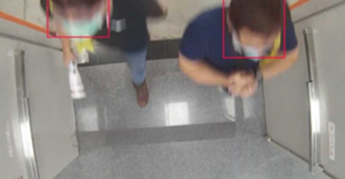
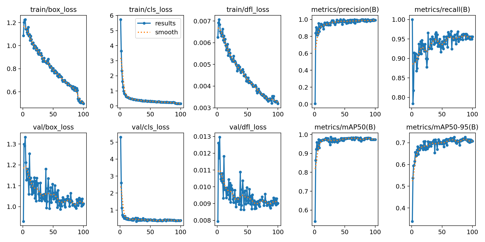
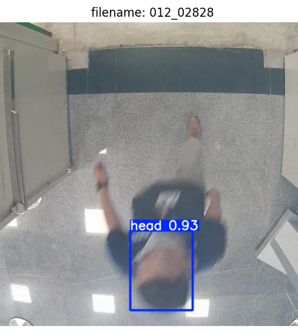
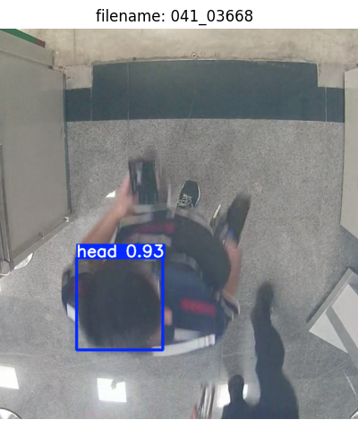
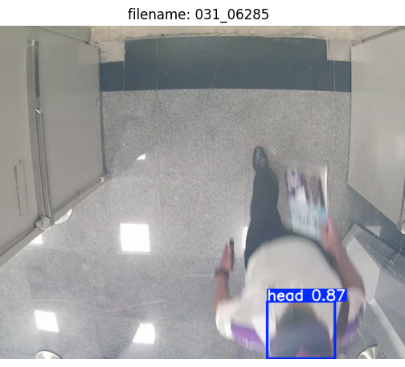
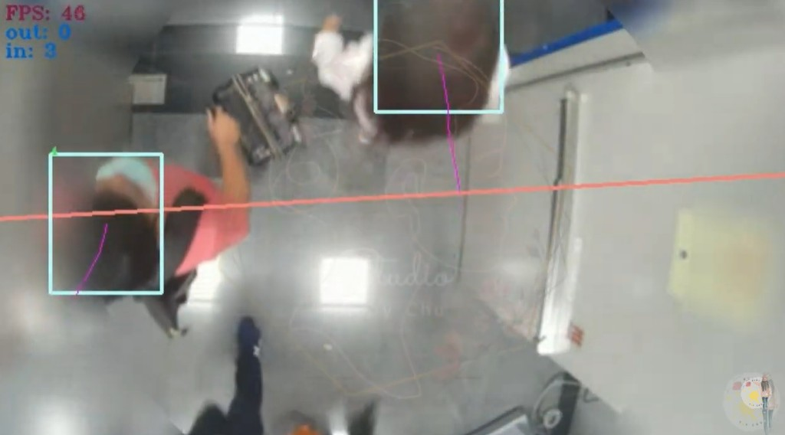

# top-down-people-counter

---
## Data Collection



| dataset | images |
| :---: | :---: |
| Training Set | 946 |
| Validation Set | 120 |
| Test Set | 120 |

---
## Train

### Download weight

download [YOLO26n.pt](https://github.com/ultralytics/assets/releases/download/v8.4.0/yolo26n.pt)

### dataset directory structure

```text
top-down-head/
├── data.yaml
├── images/
│   ├── train/
│   └── val/
└── labels/
    ├── train/
    └── val/
```

**data.yaml**

```text
path: top-down-head
train: images/train
val: images/val
names:
  0: head
```

### training

💻 Environment & Hardware<br>
Platform: kaggle<br>
GPU: NVIDIA T4<br>
Runtime: 24m 29s<br>

**training_main.py**

- Precision: 0.9934
- Recall: 0.9481
- mAP@50: 0.9835



---
## Predict

  

---
## tracking and counting

[top-down-head.pt](https://www.kaggle.com/models/chuchuying/top-down-head)
[BoT-SORT](https://github.com/NirAharon/BoT-SORT)

download [custom_botsort.yaml](https://www.kaggle.com/models/chuchuying/top-down-head)

💻 Environment & Hardware<br>
Platform: kaggle<br>
GPU: NVIDIA T4<br>

### Cross line

**Cross Line Point**

$$
(L1_x, L1_y) {-} (L2_x, L2_y)
$$

$$
\overrightarrow{{L_1}{L_2}}=({L2_x}-{L1_x}, {L2_y}-{L1_y})
$$

**object move position**

$$
(A_x, A_y) {\Rightarrow} (B_x, B_y)
$$

**Cross Product**

$$
{a}\times{b} = \parallel{a}\parallel\parallel{b}\parallel{\sin(\theta)}{n}
$$

定義物件起點為 $A(A_x, A_y)$，終點為 $B(B_x, B_y)$。計算兩個外積值 $d_1$ 與 $d_2$：

- 點 $A$ 的外積值 ($d_1$):
$$d_1 = (L2_x - L1_x) \times (A_y - L1_y) - (L2_y - L1_y) \times (A_x - L1_x)$$

- 點 $B$ 的外積值 ($d_2$):
$$d_2 = (L2_x - L1_x) \times (B_y - L1_y) - (L2_y - L1_y) \times (B_x - L1_x)$$

$d_1$ 與 $d_2$ 的相乘結果來判斷物件是否跨越線段：

- 確定跨越：代表兩點分別位於線段兩側
  $$(d_1 \times d_2) < 0$$

- 點在線上：代表起點或終點正好落在線段所在的直線上
  $$(d_1 \times d_2) = 0$$

- 未跨越：代表兩點在線段的同側
  $$(d_1 \times d_2) > 0$$

### Demo

<a href="https://youtu.be/6tnqKSoRwXM?si=ZhSSnbCXUq3yFmqL">
  
</a>
